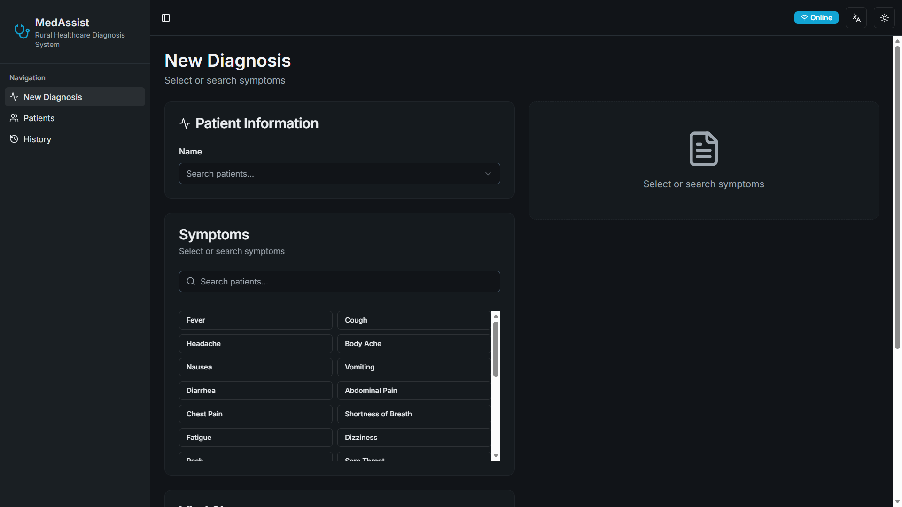

# MedAssist 🏥

AI-Powered Medical Diagnosis Assistant for Rural Healthcare Centers

## Overview

MedAssist is a medical diagnosis assistant powered by Google Gemini AI. It helps healthcare workers perform symptom analysis, generate differential diagnoses, and provide treatment recommendations. Supports 5 languages (English, Hindi, Tamil, Telugu, Bengali) with offline-first architecture.

## Landing Page



---

## Key Features

- ✅ AI-powered diagnosis using Google Gemini 2.5 Flash
- ✅ 5 language support (English, Hindi, Tamil, Telugu, Bengali)
- ✅ Offline-first with local caching
- ✅ Patient management & diagnosis history
- ✅ Vital signs integration & drug interaction checking
- ✅ Dark/Light theme support
- ✅ Mobile responsive design
- ✅ Full TypeScript type safety

## Tech Stack

React 18 • TypeScript • Tailwind CSS • Express.js • Google Gemini AI • PostgreSQL

## Project Structure

```
medassist/
├── client/src/
│   ├── pages/          # Diagnosis, Patients, History pages
│   ├── components/     # UI components
│   ├── contexts/       # Theme & Language
│   └── lib/           # Utilities & translations
├── server/            # Express backend
├── shared/            # Zod schemas
└── Config files
```

## Quick Start

**Prerequisites**: Node.js 18+, Google Gemini API key from [ai.google.dev](https://ai.google.dev/)

```bash
npm install
npm run dev
```

App runs at `http://localhost:5000`

## Scripts

```bash
npm run dev      # Start dev server
npm run build    # Build for production
npm start        # Run production
npm run check    # TypeScript check
npm run db:push  # Database migrations
```

## Features

### Diagnosis Page (`/`)
Symptom analysis, patient selection, vital signs input, treatment protocols

### Patients Page (`/patients`)
Patient management, add/edit records, search functionality

### History Page (`/history`)
Diagnosis history, filtering by date/patient/confidence, diagnosis details


## Languages

Supports: English, Hindi, Tamil, Telugu, Bengali

Translations stored in `client/src/lib/translations.ts` using React Context

## Offline Support

- Cached patient data (24-hour TTL)
- Diagnosis history available offline
- Language & theme preferences persisted
- Automatic sync when connectivity restored
- Offline indicator in header

## Database

**Patients**: id, name, age, gender, weight, contact, address  
**Diagnoses**: id, patientId, symptoms, vitalSigns, primaryDiagnosis, differentialDiagnoses, treatmentProtocol, requiresReferral, language

## Environment

**Required**:
- `GEMINI_API_KEY` - Google Gemini API key

**Optional**:
- `PORT` - Server port (default: 5000)
- `SESSION_SECRET` - Session secret (auto-generated if not provided)


## Performance & Security

**Performance**: Bundle size ~200KB, API response <200ms  
**Security**: Zod validation, TypeScript type safety, session-based auth, no stack traces exposed


## Roadmap/Future Enhancement

- **Phase 1** ✅ Diagnosis generation, patient management, multilingual support
- **Phase 2** 🔄 Advanced filtering, history analytics, export
- **Phase 3** 🔄 Mobile app, voice input
- **Phase 4** 🔄 ML predictions, telemedicine

## License & Support

Licensed under MIT License

📖 **Docs**: [SETUP_LOCAL.md](SETUP_LOCAL.md) • [design_guidelines.md](design_guidelines.md) • [replit.md](replit.md)

## Disclaimer

⚠️ **Medical Disclaimer**: MedAssist is a supplementary diagnostic tool for healthcare professionals. It's NOT a replacement for professional medical diagnosis. Always use with clinical judgment. Not for emergency situations—seek immediate care.

---

**Version**: 1.0.0 | **Last Updated**: November 28, 2024

*Built with ❤️ for Rural Healthcare By Ankit*
